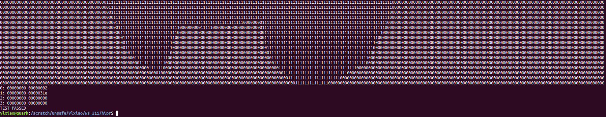

# HiPR on [Alveo U50 Data Center Accelerator Card](https://www.xilinx.com/products/boards-and-kits/alveo/u50.html)
HiPR is a python-based framework on top of [Vitis 2021.1](https://www.xilinx.com/support/download/index.html/content/xilinx/en/downloadNav/vivado-design-tools/2021-1.html). With HiPR, you can define PR sub-functions at C-Level. HiPR can parse the pragmas and automates the backend implementations.
We will use the **rendering512** on the local machine as an example. We will release **google cloud** flow and **other benchmarks** soon later.

The pre-print manuscript of our paper can be found at https://ic.ese.upenn.edu/pdf/hipr_fpl2022.pdf.
···
@inproceedings{kapre2015hoplite,
  title={Hoplite: Building austere overlay {NoCs} for {FPGAs}},
  author={Kapre, Nachiket and Gray, Jan},
  booktitle={2015 25th International Conference on Field Programmable Logic and Applications (FPL)},
  pages={1--8},
  year={2015},
  organization={IEEE}
}
···

## 1 Tool Setup

### 1.1 Vitis Preparation
The demo is developed with [Vitis 2021.1](https://www.xilinx.com/support/download/index.html/content/xilinx/en/downloadNav/vivado-design-tools/2021-1.html) 
and [Alveo U50](https://www.xilinx.com/products/boards-and-kits/alveo/u50.html)..
If you install Vitis under **/opt/Xilinx/**, you should set the **Xilinx_dir** in  [./common/configure/configure.xml](./common/configure/configure.xml) as below.
```c
    <spec name = "Xilinx_dir" value = "/opt/Xilinx/Vitis/2021.1/settings64.sh" />
```


### 1.2  Xilinx Runtim Installation
You can download the `Xilinx Runtime (xrt_202110.2.11.634_18.04-amd64-xrt)` from [here](https://www.xilinx.com/support/download/index.html/content/xilinx/en/downloadNav/alveo/u50.html)
We will install our software under your **/opt** directory. If you have no permission to write to **/opt**, you can change the permission by the command below.

```c
sudo chown $USER /opt
```

If you are using Ubuntu system, you can install the `xrt` by executing the command below.

```c
sudo apt install ./xrt_202110.2.11.634_18.04-amd64-xrt.deb
```


You should also set the features correctly in  [./common/configure/configure.xml](./common/configure/configure.xml) as below.

```c
   <spec name = "xrt_dir"            value = "/opt/xilinx/xrt/setup.sh" />
```

### 1.3  AU50 Development Target Platform
You can downlowd Development Target Platform (xilinx-u50-gen3x16-xdma-dev-201920.3-2784799_all) from [here](https://www.xilinx.com/support/download/index.html/content/xilinx/en/downloadNav/alveo/u50.html).

After you install the platform, you should set these features correctly in  [./common/configure/au50/configure.xml](./common/configure/au50/configure.xml) as below.


```c 
  <spec name = "PLATFORM"            value = "xilinx_u50_gen3x16_xdma_201920_3" />
```


## 2 Benchmark Preparation
1. To get our [Makefile](./Makefile) to work, you need to copy your application cpp
code to a certain directory. We take 
**rendering512** as an example.
2. We have already created the directory [rendering512](./input_src) with the same 
name as the benchmark under '**./input_src**'.
3. We create one cpp file and one header file for each operator. In 
[./input_src/rendering512/operators](./input_src/rendering512/operators), we
can see 7 operators to be mapped to partial reconfigurable pages.
The directory structure is as below.

```c
input_src/rendering512/
├── cfg
│   ├── u50_dfx.cfg
│   ├── zcu102.cfg
│   └── zcu102_dfx.cfg
├── host
│   ├── host.cpp
│   ├── input_data.h
│   ├── main.cpp
│   ├── top.cpp
│   ├── top.h
│   └── typedefs.h
├── Makefile
├── operators
│   ├── coloringFB_bot_m.cpp
│   ├── coloringFB_bot_m.h
│   ├── coloringFB_top_m.cpp
│   ├── coloringFB_top_m.h
│   ├── data_redir_m.cpp
│   ├── data_redir_m.h
│   ├── data_transfer.cpp
│   ├── data_transfer.h
│   ├── rasterization2_m.cpp
│   ├── rasterization2_m.h
│   ├── zculling_bot.cpp
│   ├── zculling_bot.h
│   ├── zculling_top.cpp
│   └── zculling_top.h
├── sw_emu
    ├── build_and_run.sh
    ├── Makefile
    └── xrt.ini

```

4. We can set the page number and target (HIPR) in the header file
for each [operator](input_src/rendering512/operators/data_redir_m.h).

```c
#pragma map_target = HIPR
#pragma clb =4 ff = 1 bram =2.4 dsp =1.2
```

5. We use a **top** function in [./input_src/rendering512/host/top.cpp](./input_src/rendering512/host/top.cpp)
to show how to connect different operators together.
 
## 3 Tutorial 1: Software Simulation
Go to [./input_src/rendering512](input_src/rendering512) and type `make`, you will get the software simulation to run. The results are as below.


## 4 Tutorial 2: Install Setup Files
1. Below you compile any applications, you need to install the necessary setup files by executing commands as below. This step can take hours. The setup files can be reused by different applications.

```c
make install
```

## 5 Tutorial 3: Map one Operator to one PR Region

1. In the [Makefile](./Makefile), change the **prj_name** to **rendering512**. You can also change the frequency you want. Currently, we support 100MHz, 150MHz, 200MHz, 250MHz, 300MHz.

```c
    prj_name=rendering512
    freq=200M
```

2. Type '**Make -j$(nproc)**'. It will generate all the necessary DCP and 
bitstream files automatically. Different operators can be compiled in 
parallel according to the thread number of your local machine. Be careful
with the memory requirements, when you use multi-threads to compile the 
project. When I use 4 threads to compile, I at least need 32 GB DDR 
memory.
```c
Make -j$(nproc)
```

3. After all the compile tasks are completed, you can see the abstract shell dcp for each DFX pages under [.workspace/F001_overlay_rendering512_200M/au50_dfx_hipr/checkpoint](workspace/F001_overlay_rendering512_200M/au50_dfx_hipr/checkpoint).

4. Type `make run`, you will see the results below.



5. If you see errors below, just type `make run` again. This error may show several times. We believe it is a bug from `Xilinx Runtime`.


6. Run the command below to get the runtime of the application. You can see the runtime for rendering512 is 1.58 ms.

```c
cat ./workspace/F005_bits_rendering512_200M/opencl_summary.csv
```


7. In the terminal type `make report`, you will see the resource, compile time and STA timing reports as below. As you can see, we only define function `data_redir_m` as partial reconfigurable.


8. You can change [input_src/rendering512/operators/data_redir_m.cpp](input_src/rendering512/operators/data_redir_m.cpp) and type `make`, you will see the HiPR only re-compile function `data_redir_m` only.


## 6 Tutorial 4: Map all Operators to PR Regions

1. In the [Makefile](./Makefile), change the **prj_name** to **rendering512**. You can also change the frequency you want. Currently, we support 100MHz, 150MHz, 200MHz, 250MHz, 300MHz.

```c
    prj_name=rendering512_all
    freq=200M
```

2. Type '**Make -j$(nproc)**'. It will generate all the necessary DCP and 
bitstream files automatically. Different operators can be compiled in 
parallel according to the thread number of your local machine. Be careful
with the memory requirements, when you use multi-threads to compile the 
project. When I use 4 threads to compile, I at least need 32 GB DDR 
memory.
```c
Make -j$(nproc)
```

3. After all the compile tasks are completed, you can see the abstract shell dcp for each DFX pages under [.workspace/F001_overlay_rendering512_200M/au50_dfx_hipr/checkpoint](workspace/F001_overlay_rendering512_200M/au50_dfx_hipr/checkpoint).

4. Type `make run`, you will see the results below.


5. If you see errors below, just type `make run` again. This error may show several times. We believe it is a bug from `Xilinx Runtime`.


6. Run the command below to get the runtime of the application. You can see the runtime for rendering512 is 1.58 ms.

```c
cat ./workspace/F005_bits_rendering512_all_200M/opencl_summary.csv
```


7. In the terminal type `make report`, you will see the resource, compile time and STA timing reports as below. As you can see, we define all the sub-functions as partial reconfigurable.


8. You can change any files in [input_src/rendering512_all/operators](input_src/rendering512_all/operators) and type `Make -j$(nproc)`, you will see the HiPR only re-compile modified functions in parallel.


